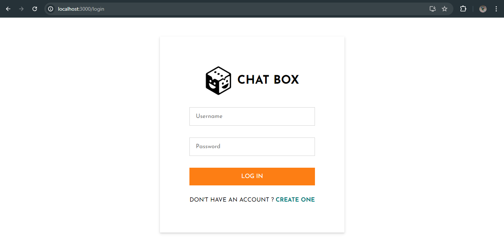
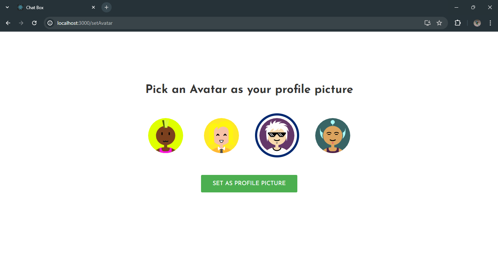
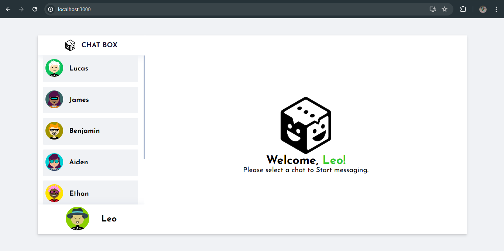
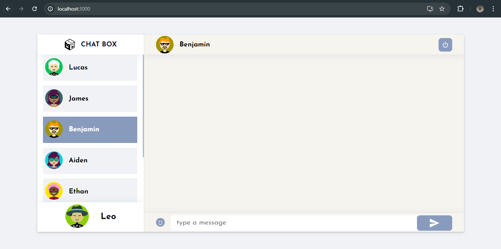
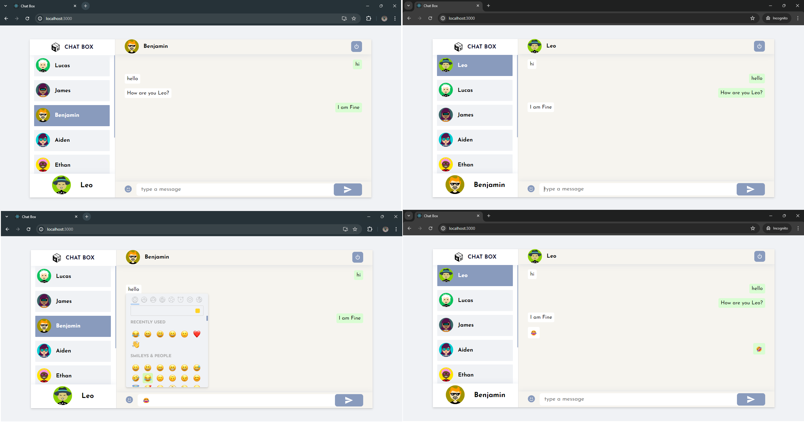

# ChatBox - Chat Application

ChatBox is chat application build with the power of MERN Stack.

#### Login Page



#### Registration Page


#### Choose Avatar



#### User Dashboard



#### Select Person



#### User Chat



## Installation Guide

### Requirements

- [Nodejs](https://nodejs.org/en/download)
- [Mongodb](https://www.mongodb.com/docs/manual/administration/install-community/)

Both should be installed and make sure mongodb is running.

### Installation

#### First Method

```shell
git clone https://github.com/shivankushsingh09/ChatBox.git
cd ChatBox
```

Now rename env files from .env.example to .env

```shell
cd public
mv .env.example .env
cd ..
cd server
mv .env.example .env
cd ..
```

Now install the dependencies

```shell
cd server
yarn
cd ..
cd public
yarn
```

We are almost done, Now just start the development server.

For Frontend.

```shell
cd public
yarn start
```

For Backend.

Open another terminal in folder, Also make sure mongodb is running in background.

```shell
cd server
yarn start
```

Done! Now open localhost:3000 in your browser.

#### Second Method

- This method requires docker and docker-compose to be installed in your system.
- Make sure you are in the root of your project and run the following command.

```shell
docker compose build --no-cache
```

after the build is complete run the containers using the following command

```shell
docker compose up
```

now open localhost:3000 in your browser.
